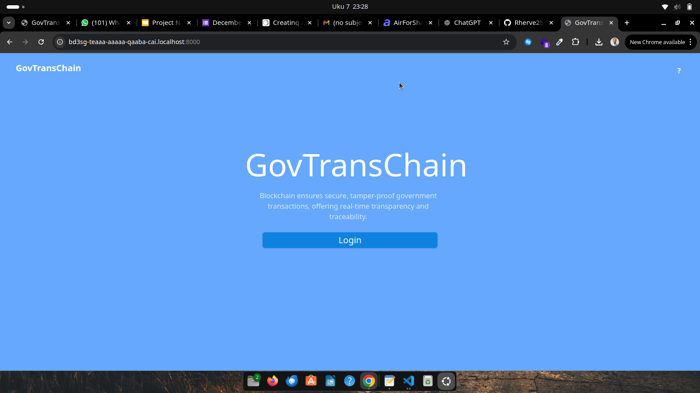
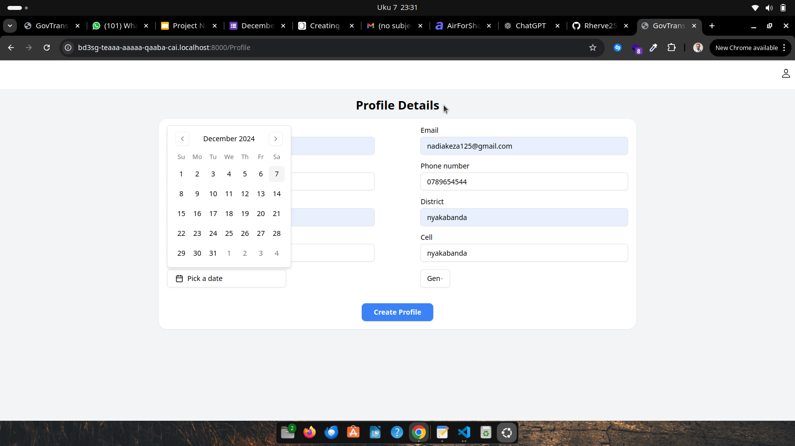
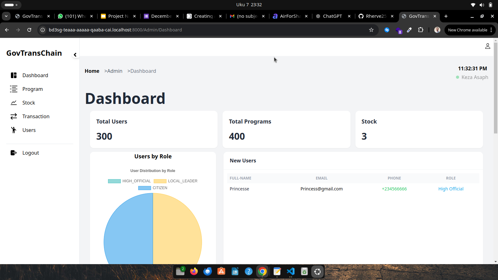

# GovTransChain

## Overview

GovTransChain is an innovative blockchain-based platform designed to revolutionize government fund distribution by ensuring transparency, accountability, and efficiency at every level of the process. The platform is tailored to address common issues like fund mismanagement, corruption, and lack of traceability in traditional distribution systems.

By leveraging blockchain technology, GovTransChain introduces a decentralized, secure, and verifiable method for transferring funds through various administrative levels—from national agencies to local communities and individual beneficiaries.

## Data Flow


## User Login & Profile Setup  
1. **Login with ICP Identity:**  
   - Users log in using their **ICP Identity** for secure authentication.  
2. **Profile Creation:**  
   - First-time users are redirected to a profile creation page to set up their account.  

---

## System Roles & Functionalities  

### 1. **HIGH_OFFICIAL**  

- **Program Management:**  
  - Create programs and allocate stock.  
- **Analytics and Monitoring:**  
  - View overall distribution statistics for comprehensive insights.  
- **Fund and Material Distribution:**  
  - Transfer funds and relief materials to **Local Leaders**.  
- **Program Participant Management:**  
  - Add Local Leaders to programs.  
  - Approve Citizens for program participation.  

---

### 2. **LOCAL_LEADER**  
Local Leaders facilitate the distribution process within their communities. Key features include:  
- **Citizen Admission:**  
  - Enroll Citizens into programs.  
- **Fund Distribution:**  
  - Allocate funds to approved Citizens.  
- **Material Distribution:**  
  - Distribute relief materials to program participants.  

---

### 3. **CITIZENS**  
Citizens are the beneficiaries of the platform. Key features include:  
- **Fund and Material Acceptance:**  
  - Receive funds and relief materials distributed through the system.  
- **Transaction Records:**  
  - View and track all transactions for transparency and accountability.  

---

### Prerequisites

requirements: Please install these versions or high

- **dfx**: You have installed the latest version of the DFINITY Canister SDK, `dfx`. You can download it from the DFINITY SDK page. [installation guide](https://demergent-labs.github.io/azle/get_started.html#installation)

 ```
  use version dfx 0.22.0
 ```
- **Node.js**: You have installed Node.js, version 18 or above.
```
 v20.12.2

```
- Azle version use 
 ```
  azle 0.24.1
 ```

 - podman verion use

 ```
  podman version 3.4.4
  
 ```
Please ensure all these prerequisites are met before proceeding with the setup of the project.

# Running the project locally

If you want to test your project locally, you can use the following commands:

Cloning repo:

```bash
git clone https://github.com/Rherve250/GovTransChain.git
cd GovTransChain
```


### to install and deploy Step by Step Follow below commands:

```bash

# Installing Dependencies
npm i

# Starts the replica, running in the background
dfx start --host 127.0.0.1:8000 --clean --background

# Deploys
dfx deploy
or

AZLE_AUTORELOAD=true dfx deploy
```

your application will be available at `http://localhost:8000?canisterId={asset_canister_id}`.
` http://{canisterId}.localhost:8000/`

* Homepage


* Onboarding


* Statistics



* High official adding program


    

   
  


      